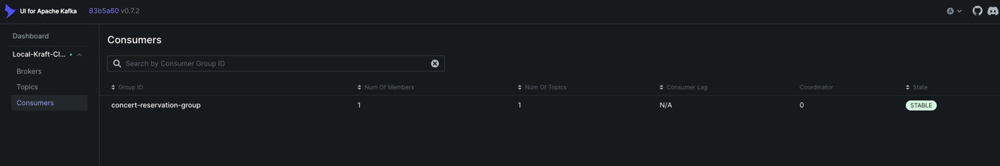

# ‘콘서트 예약 서비스’ 시나리오 기반

---

## 📚Kafka

### 📮 토픽 (Topic)
-  메시지가 저장되는 카테고리/주제
-  메시지를 논리적으로 분류하고 구분
-  우체국의 '일반우편', '등기우편' 같은 우편함 종류

### 📤 프로듀서 (Producer)
- 메시지를 토픽으로 보내는 클라이언트
- 이벤트를 생성하고 Kafka로 발행
- 편지를 쓰고 우체통에 넣는 사람

### 📥 컨슈머 (Consumer)
- 토픽에서 메시지를 읽어오는 클라이언트
- 이벤트를 수신하고 비즈니스 로직 처리
- 우체통에서 편지를 가져가서 읽는 사람

### 👥 컨슈머 그룹 (Consumer Group)
- 같은 목적을 가진 컨슈머들의 집합
- 파티션을 분담해서 병렬 처리하고 중복 처리 방지
- 같은 회사의 우편 담당 직원들 (각자 다른 지역 담당)

### 🏢 브로커 (Broker)
-  Kafka 서버 인스턴스 하나
-  메시지를 저장하고 전달하는 실제 서버
-  우체국 지점 하나하나가 브로커

### 🏪 클러스터 (Cluster)
- 여러 브로커들이 모여서 하나의 시스템을 구성
- 고가용성과 확장성을 제공
- 우체국 본부 + 모든 지점들이 클러스터

### 📦 파티션 (Partition)
- 토픽을 나눈 조각들
- 병렬 처리와 확장성을 제공
- 우체국의 각 접수창구가 파티션

---
#### 카프카 CLI 실습 in Docker

```bash
# 1. 토픽 생성
kafka-topics.sh --create \
--topic concert.reservation.completed \
--bootstrap-server localhost:9092 \
--partitions 3 \
--replication-factor 1

# 2. 토픽 확인
kafka-topics.sh --bootstrap-server localhost:9092 --list

# 3. 프로듀서로 메시지 전송
kafka-console-producer.sh \
--bootstrap-server localhost:9092 \
--topic concert.reservation.completed

{"concertScheduleId":"WorldDJFestival20250614", "reservedAt":"20250528"}
{"concertScheduleId":"WorldDJFestival20250615", "reservedAt":"20250528"}


# 4. 컨슈머 실행
kafka-console-consumer.sh \
--bootstrap-server localhost:9092 \
--topic concert.reservation.completed \
--from-beginning \
--group concert-reservation-group
```
#### UI 확인



---
### 🧬 전체적인 관계도

```
📮 토픽 (Topic)
 ├── 📦 파티션 0 ─── 🏢 브로커1 (Leader)
 ├── 📦 파티션 1 ─── 🏢 브로커2 (Leader)  
 └── 📦 파티션 2 ─── 🏢 브로커3 (Leader)
      ↑                    ↑
   📤 프로듀서            📥 컨슈머 그룹
 (메시지 생성)          (메시지 소비)
      ↓                    ↓
 Reservation Service   👥 ranking-service
 Payment Service         ├── Consumer 1 → P0
                         ├── Consumer 2 → P1  
                         └── Consumer 3 → P2
```

### 🔄 데이터 플로우
```
1. 프로듀서가 토픽에 메시지 발행
2. 메시지가 파티션별로 분산 저장  
3. 각 파티션이 다른 브로커에 복제
4. 컨슈머 그룹의 컨슈머들이 파티션별로 분담 처리
5. 같은 메시지를 다른 컨슈머 그룹이 각각 독립적으로 처리
```

### 1. 브로커 3개가 필요한 이유

#### ❌ 브로커 1개인 경우
```
[Broker 1] - 단일 장애점 (SPOF)
```
- 브로커 1개가 죽으면 → 전체 시스템 다운
- 백업 없음, 복구 불가능

#### ⚠️ 브로커 2개인 경우
```
[Broker 1] ←→ [Broker 2]
```
- 네트워크 분할 시 → Split Brain 문제
- 어느 쪽이 진짜 리더인지 모름
- 데이터 일관성 문제 발생

#### ✅ 브로커 3개인 경우
```
    [Broker 1]
   /          \
[Broker 2] ←→ [Broker 3]
```
- **과반수 투표 가능**: 2/3 = 과반수
- 1개 브로커 장애 시에도 → 2개로 계속 동작
- **Split Brain 방지**: 항상 과반수 판단 가능

### 2. 파티션 3개가 필요한 이유

#### 🚀 병렬 처리 향상
```
토픽: concert.reservation.completed

파티션 1개:  [Consumer 1] ← [P0] ← [Producer]
처리량: 1개 컨슈머만 처리

파티션 3개:  [Consumer 1] ← [P0] ← [Producer]
            [Consumer 2] ← [P1] ← [Producer]  
            [Consumer 3] ← [P2] ← [Producer]
처리량: 3개 컨슈머가 동시 처리 (3배 빨라짐)
```

#### 📈 확장성
```
초기: 사용자 1,000명 → 파티션 3개면 충분
성장: 사용자 100,000명 → 파티션 추가로 확장 가능
```

#### 🛡️ 장애 격리
```
P0 장애 → P1, P2는 정상 동작 (66% 처리량 유지)
모든 파티션 1개 → 장애 시 100% 중단
```
---

### 🤔 컨슈머 1개 vs 3개 비교

#### 컨슈머 1개인 경우
```
Ranking Service Consumer Group (1개)
└── Consumer 1 → [P0, P1, P2] 모두 처리

장점: 
- 간단한 구조
- 순서 보장 (전체적으로)

단점:
- 처리 속도 느림 (순차 처리)
- 장애 시 모든 파티션 중단
- 확장 불가능
```

#### 컨슈머 3개인 경우
```
Ranking Service Consumer Group (3개)
├── Consumer 1 → P0 처리
├── Consumer 2 → P1 처리  
└── Consumer 3 → P2 처리

장점:
- 3배 빠른 처리 속도
- 부분 장애 시에도 계속 동작
- 확장 가능 (파티션 추가 시)

단점:
- 약간 복잡한 구조
```

### 📊 처리량 비교
```
예시: 시간당 10,000개 예약 완료 이벤트

컨슈머 1개: 10,000개 / 1 = 10,000개/시간 처리
컨슈머 3개: 10,000개 / 3 = 각각 3,333개/시간 처리 (병렬)

실제로는 3개가 동시에 처리하므로 전체 처리량 동일
하지만 각 컨슈머의 부하는 1/3로 감소
```

### ⚖️ 성능 vs 복잡성
```
단순함이 필요한 경우:
- 이벤트 양이 매우 적음 (시간당 < 100개)
- 개발/운영 리소스 부족
→ 컨슈머 1개 사용

성능이 중요한 경우:
- 이벤트 양이 많음 (시간당 > 1,000개)  
- 실시간 처리 필요
- 장애 복구력 중요
→ 컨슈머 3개 사용 (권장)

📈 랭킹 서비스 = 컨슈머 3개

이유: 복잡한 계산 + 실시간 처리 + 높은 처리량
목적: 빠른 랭킹 업데이트로 사용자 경험 향상

📋 큐 서비스 = 컨슈머 1개

이유: 대기열 순서 보장이 중요
목적: 공정한 대기열 관리

📧 외부 서비스 = 컨슈머 1개

이유: 알림 발송의 안정성이 중요
목적: 확실한 알림 전달

💡 비유로 설명하면
같은 "예약 완료" 소식을 듣고도:

랭킹팀: 3명이 동시에 통계 계산 (빨라야 함)
대기열팀: 1명이 차근차근 순서 정리 (정확해야 함)
알림팀: 1명이 안전하게 문자 발송 (확실해야 함)
```

---

### 실제 Kafka 구현에서의 이벤트 플로우


### 장애 상황에서의 동작


