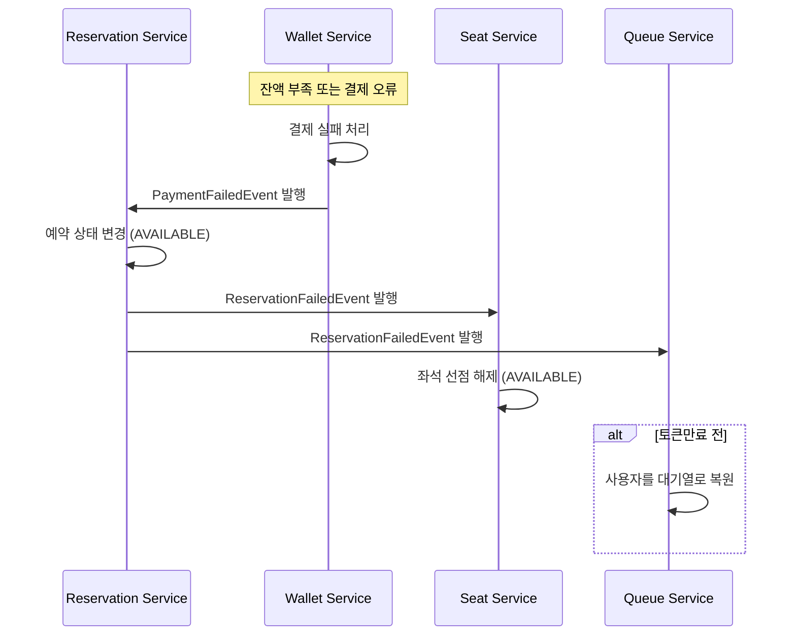

# ‘콘서트 예약 서비스’ 시나리오 기반

### 📋 MSA 형태의 코레오그래피 기반 Saga 패턴을 활용한 분산 트랜잭션 처리 및 이벤트 기반 시스템 통합 설계

---

### 우선, 기존 파사드(Facade)의 역할 제거 필요

기존 파사드는 여러 서비스 호출을 묶는 조율자 역할을 하며, **동기 방식의 트랜잭션 처리**에 기반해 있었지만 MSA에서는 아래과 같이 대체할 수 있다.

| 기존 방식 | 변경 방식 (MSA) |
| --- | --- |
| 파사드 내부에서 동기 호출 조합 | 각 서비스가 독립 마이크로서비스로 분리되어 **이벤트 기반 비동기 호출** 사용 |

파사드를 제거하려면:

- **이벤트 퍼블리셔 → 리스너 구조로 조율** 전환해야 함

## 🏗️ 시스템 아키텍처

### 마이크로서비스 구성

| 서비스명 | 책임 | 주요 기능 |
| --- | --- | --- |
| **Queue Service** | 대기열 관리 | 토큰 발급/검증, 활성열,대기열 관리 |
| **Concert Service** | 콘서트 정보 관리 | 콘서트 정보 조회 |
| **Concert Schedule Service** | 콘서트 스케줄 관리 | 공연 스케줄 조회 |
| Seat Service | 콘서트 좌석 관리 | 좌석 상태 관리, 선점/해제 |
| **Reservation Service** | 예약 관리 | 예약 생성/상태 관리 |
| **Ranking Service** | 랭킹 관리 | 랭킹 적재 |
| **Wallet Service** | 결제 처리 | 결제 진행/완료 |
| **Wallet History Service** | 결제 히스토리  | 결제 히스토리 적재 |
| **External Data Service** | 외부 데이터 연동 | 외부 플랫폼 데이터 전송 |

---

## 🔄 전체 비즈니스 플로우

### 정상 플로우

```mermaid
sequenceDiagram
    autonumber
    participant User
    participant Queue as Queue Service
    participant Seat as Seat Service
    participant Reservation as Reservation Service
    participant Wallet as Wallet Service
    participant History as Wallet History Service
    participant Ranking as Ranking Service
    participant External as External Data Service

    %% 1. 토큰 발급 및 활성열 진입
    rect rgb(0, 0, 0)
    Note right of User: Step 1: 토큰 발급
    User->>Queue: 토큰 발급 요청
    Queue->>Queue: 대기열 처리
    Queue->>Queue: 활성열 진입
    Queue->>User: 토큰 발급 (5분 TTL)
    end

    %% 2. 예약 생성 및 좌석 선점
    rect rgb(0, 0, 0)
    Note right of User: Step 2: 좌석 선점
    User->>Reservation: 예약 생성 요청 
    Queue->>Queue: 토큰 검증
    Reservation->>Reservation: 예약 생성 (PENDING)
    Reservation->>Seat: 좌석 선점 요청
    Seat->>Seat: 좌석 상태 변경 (PENDING)
    Seat->>Reservation: SeatReservedEvent 발행
    end

    %% 3. 결제 처리
    rect rgb(0, 0, 0)
    Note right of User: Step 3: 결제 처리
    Reservation->>Wallet: PaymentRequestEvent 발행
    Wallet->>Wallet: 잔액 확인 및 차감
    Wallet->>Wallet: 결제 처리 완료
    Wallet->>Reservation: PaymentCompletedEvent 발행
    Wallet->>History: PaymentCompletedEvent 발행
    end

    %% 4. 예약 완료 처리
    rect rgb(0, 0, 0)
    Note right of User: Step 4: 예약 확정
    Reservation->>Reservation: 예약 상태 변경 (RESERVED)
    Reservation->>Seat: 좌석 확정 요청
    Seat->>Seat: 좌석 상태 변경 (RESERVED)
    Reservation->>Queue: ReservationCompletedEvent 발행
    Reservation->>Ranking: ReservationCompletedEvent 발행
    Reservation->>External: ReservationCompletedEvent 발행
    end

    %% 5. 후속 처리
    rect rgb(0, 0, 0)
    Note right of User: Step 5: 후속 처리
    Queue->>Queue: 토큰 만료 처리
    History->>History: 거래 이력 저장
    Ranking->>Ranking: 콘서트 랭킹 업데이트
    External->>External: 외부 플랫폼 데이터 전송
    end
```

---

## 💥 보상 트랜잭션 플로우

### 결제 실패 시나리오

**보상 액션:**

- 예약 상태: PENDING → AVAILABLE
- 좌석 상태: PENDING → AVAILABLE
- 토큰 상태: 대기열 복원 또는 재발급

---

## 📊 이벤트 설계

### 1. 좌석 관련 이벤트

| 이벤트명 | 발행 조건 | 구독자 | 페이로드 |
| --- | --- | --- | --- |
| `SeatReservedEvent` | 좌석 선점 성공 | Reservation Service | seatId, reservationId |
| `SoldOutEvent` | 매진 처리 | Ranking Service | concertScheduleId, soldOutTime |

### 2. 예약 관련 이벤트

| 이벤트명 | 발행 조건 | 구독자 | 페이로드 |
| --- | --- | --- | --- |
| `PaymentRequestEvent` | 결제 요청 | Wallet Service | reservationId, userId, walletMethod |
| `ReservationCompletedEvent` | 예약 완료 | Queue, Ranking, External Service | reservationId, userId |
| `ReservationFailedEvent` | 예약 실패 | Queue, Seat Service | reservationId, userId |

### 3. 결제 및 충전 관련 이벤트

| 이벤트명 | 발행 조건 | 구독자 | 페이로드 |
| --- | --- | --- | --- |
| `ChargedCompletedEvent` | 충전 완료 | Wallet History Service | walletId, userId, reservationId |
| `ChargedFailedEvent` | 충전 실패 | Wallet History Service | walletId, userId,  |
| `PaymentCompletedEvent` | 결제 완료 | Reservation, Wallet History Service | walletId, userId, reservationId |
| `PaymentFailedEvent` | 결제 실패 | Wallet History Service | walletId, userId,  |

---

## 코레오그래피 패턴?

**코레오그래피 기반 Saga 패턴**은 각 서비스가 이벤트를 구독하고 자신의 로컬 트랜잭션을 수행하며, 실패 시 보상 이벤트를 발행하는 패턴

→ 콘서트 예약 시스템의 복잡한 비즈니스 플로우를 MSA 환경에서 안정적으로 처리하기 위해 **코레오그래피 기반 Saga 패턴**을 통해 서비스 간 느슨한 결합을 유지하고 보상 트랜잭션 메커니즘으로 데이터 일관성을 보장하였다.

### 이로써...
- 각 도메인을 마이크로서비스로 분리하여 독립 배포 및 스케일링 가능
- 이벤트를 통해 비동기 처리 및 장애 복원력 강화
- 보상 트랜잭션 로직을 명확히 정의하여 일관성 유지